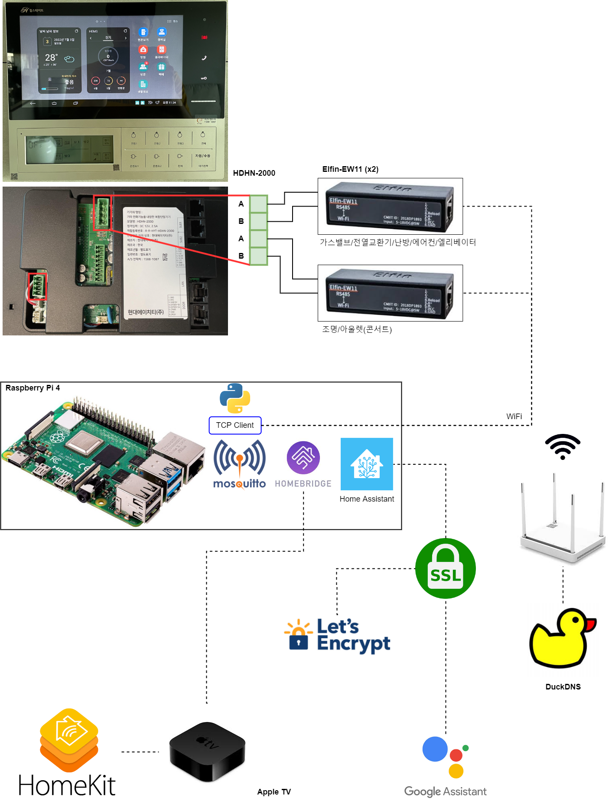

# YOGYUI Home Network: Hillstate-Gwanggyosan

Integrate **Hillstate (Hyundai HT) `RS-485 based Wallpad` Home Network** to IoT Platforms (like **Apple HomeKit** and **Google Assistant**).<br>

<br>
Developer's Comments
---
I only tested this code on wallpad model **HDHN-2000**. <br>
If you have any problems adopting this repository into other wallpad model, please let me know.<br>
E-mail: lee2002w@gmail.com

Installation
---
Notice: scripts below are assumed to be run on **Raspberry Pi (with Raspbian OS)** SBC.
1. Clone repository
    ```
    $ mkdir ~/repos
    $ cd ~/repos
    $ git clone https://github.com/YOGYUI/HomeNetwork.git
    $ cd HomeNetwork/Hillstate-Gwanggyosan
    ```
2. Install python3 requirements
    ```
    $ sudo pip3 install -r requirements.txt
    ```

Configuration
---
All configurations needed to run application properly are stored in 
[config.xml](https://github.com/YOGYUI/HomeNetwork/blob/main/Hillstate-Gwanggyosan/config.xml) 
file. <br>
1. RS-485 to UART Converter 
    - Common
        ```xml
        <rs485>
            <port>
                <name>port name</name>
                <index>0</index>
                <enable>1</enable>
                <packettype>0</packettype>
                <check>1</check>
                <buffsize>64</buffsize>
                <thermo_len_per_dev>3</thermo_len_per_dev>
                <command>
                    <interval_ms>100</interval_ms>
                    <retry_count>50</retry_count>
                </command>
            </port>
        </rs485>
        ```
        `name`: unique string to distinguish from other ports. <br>
        `index`: unique number (zero based) for mapping port with device. (Minimum index value shoud be **0**. See **4. Parser Mapping** also) <br>
        `enable`: 1=enable this port, 0=disable this port. <br>
        `packettype`: 0=regular, 1=kitchen subphone <br>
        `check`: periodic check connection status and try to reconnect. <br>
    - RS-485 to USB converter <br>
        `hwtype` should be **0**
        ```xml
        <rs485>
            <port>
                <hwtype>0</hwtype>
                <usb2serial>
                    <port>/dev/ttyUSB0</port>
                    <baud>9600</baud>
                    <databit>8</databit>
                    <parity>N</parity>
                    <stopbits>1</stopbits>
                </usb2serial>
            </port>
        <rs485>
        ```
        ⚠️ kitchen subphone setting <br>
        `baud`: 3840 <br>
        `databit`: 8 <br>
        `parity`: E <br>
        `stopbits`: 1 <br>
    - Wireless (TCP based) RS-485 converter (like **EW11**) <br>
        `hwtype` should be **1**
        ```xml
        <rs485>
            <port>
                <hwtype>1</hwtype>
                <ew11>
                    <ipaddr>192.168.0.2</ipaddr>
                    <port>8899</port>
                </ew11>
            </port>
        <rs485>
        ```
        `ipaddr`: ip address or dns for ew11 <br>
        `port`: port number for ew11 <br>
1. MQTT Broker (like Mosquitto) Configuration
    ```xml
    <config>
        <mqtt>
            <host>...</host>
            <port>...</port>
            <username>...</username>
            <password>...</password>
        </mqtt>
    </config>
    ```
    `host`: MQTT broker address (if mosquitto is running on same SBC, **127.0.0.1** or **0.0.0.0** can be used) <br>
    `port` MQTT broker port <br>
    `username`: MQTT broker authentication id <br>
    `password`: MQTT broker authentication password <br>

    ❗If advanced authentication method (like SSL/TLS) is required, please tell me.
1. Device Configuration <br>
    MQTT topics to get/set control should be carefully modified in this section. <br>
    These topics should be matched to your home network platform's(like homebridge, homeassistant) configuration. <br>
    ```xml
    <config>
        <device>
            <entry>
                <dev_type>
                    <name>Device Name</name>
                    <index>Device Index</index>
                    <room>Room Index</room>
                    <enable>1</enable>
                    <!--
                    <mqtt>
                        <publish>home/state/dev_type/room_index/dev_index</publish>
                        <subscribe>home/command/dev_type/1room_index/dev_index</subscribe>
                    </mqtt>
                    -->
                </dev_type>
                <dev_type>
                    <!-- ... -->
                </dev_type>
            </entry>
        </device>
    </config>
    ```
    `dev_type`: light, outlet, thermostat, airconditioner, gasvalve, ventilator, elevator, subphone, hems, batchoffsw, emotionlight, dimminglight<br>
    `index` and `room` tag value is **0-based** integer. <br>
    `enable` tag means whether or not add this device. (1=enable, 2=disable) <br>
    MQTT topic is automatically assigned when device is created. If you want to customize topic, uncomment and modify pub/sub topic.
    - `publish` topic means updating current state **to** home network accessories.
    - `subscribe` topic means receiving state changing command **from** home network platform.
    
    You can find other optional tags for various device types in xml file in repository. Please take a look for a moment before building your own environment.
1. **Parser Mapping**
    ```xml
    <config>
        <device>
            <parser_mapping>
                <light>0</light>
                <outlet>0</outlet>
                <gasvalve>1</gasvalve>
                <thermostat>1</thermostat>
                <ventilator>1</ventilator>
                <airconditioner>1</airconditioner>
                <elevator>1</elevator>
                <subphone>2</subphone>
                <batchoffsw>1</batchoffsw>
                <hems>2</hems>
                <emotionlight>0</emotionlight>
                <dimminglight>0</dimminglight>
            </parser_mapping>
        </device>
    </config>
    ```
    Index(number) which is configured in **rs485** tag should be matched to related devices. <br>
    Script example above means that **'Light'** related RS-485 packets are streaming on index 0 converter and **'Gas Valve'** related packets are streaming on index 1 converter.<br>
    If you use only one converter, these values should be all set to 0.
1. **Automatic Device Discovery** <br>
    You can add device entries into config file automatically with this function. <br>
    parser index mapping values are also configured via discovery.
    ```xml
    <config>
        <device>
            <discovery>
                <enable>0</enable>
                <timeout>60</timeout>
                <reload>1</reload>
		    </discovery>
        </device>
    </config>
    ```
    `enable`: when this value is **1**, automatic discovery will be started when the application is initialized.<br>
    `timeout`: discovery will be maintained until this value. (unit=second)<br>
    `reload`: when the discovery sequence terminated and if this value is **1**, application will be restarted. (discovery will be disabled after reloading.)<br>

MQTT Payload Template
---
IoT platform (Homebridge or HomeAssistant) MQTT accessories should be implemented refer to `json` format payload templates below.

<details>
<summary>Light</summary>
<div markdown="1">

### Application `Publish` / IoT platform `Subscribe`
default topic: `/home/state/light/{room_index}/{dev_index}`
```json
{
    "state": 1  // possible value: 0, 1 (numeric)
}
```
`state`: **1** means the light is 'ON' state and **0** means 'OFF' state. 
### Application `Subscribe` / IoT platform `Publish`
default topic: `/home/command/light/{room_index}/{dev_index}`
```json
{
    "state": 1  // possible value: 0, 1 (numeric)
}
```
`state`: **1** means command to 'turn ON' the light and **0** means 'turn OFF'.
</div>
</details>

<details>
<summary>Outlet</summary>
<div markdown="1">

### Application `Publish` / IoT platform `Subscribe`
default topic: `/home/state/outlet/{room_index}/{dev_index}`
```json
{
    "state": 1  // possible value: 0, 1 (numeric)
}
```
`state`: **1** means the outlet is 'ON' state and **0** means 'OFF' state. <br>
(Power consumption information maybe added later)
### Application `Subscribe` / IoT platform `Publish`
default topic: `/home/command/outlet/{room_index}/{dev_index}`
```json
{
    "state": 1  // possible value: 0, 1 (numeric)
}
```
`state`: **1** means command to 'turn ON' the outlet and **0** means 'turn OFF'.
</div>
</details>

<details>
<summary>Thermostat</summary>
<div markdown="1">

### Application `Publish` / IoT platform `Subscribe`
default topic: `/home/state/thermostat/{room_index}/0`
```json
{
    "state": "HEAT",  // possible value: "HEAT", "OFF" (string)
    "currentTemperature": 25,  // numeric
    "targetTemperature": 26,  // numeric
}
```
`state`: current state of thermostat ("HEAT" means turned on, "OFF" means turned off)<br>
`currentTemperature`: current nearby temperature (sensor value)<br>
`targetTemperature`: current target(setting) temperature of thermostat<br>
### Application `Subscribe` / IoT platform `Publish`
default topic: `/home/command/thermostat/{room_index}/0`
```json
{
    "state": "HEAT",  // possible value: "HEAT", "OFF" (string)
    "targetTemperature": 27
}
```
`state`: "HEAT" means turn 'ON' thermostat, "OFF" means turn 'OFF<br>
`targetTemperature`: change target(setting) temperature. Floating value is supported but truncated as integer in application<br>
</div>
</details>

<details>
<summary>Airconditioner</summary>
<div markdown="1">

### Application `Publish` / IoT platform `Subscribe`
default topic: `/home/state/airconditioner/{room_index}/0`
```json
{
    "active": 1,  // possible value: 0, 1 (numeric)
    "state": "COOLING",  // possible value: "COOLING", "INACTIVE" (string)
    "currentTemperature": 25,  // numeric
    "targetTemperature": 26,  // numeric
    "rotationspeed": 25,  // possible value: 25, 50, 75, 100 (numeric)
    "rotationspeed_name": "Auto"  // possible value: "Min", "Medium", "Max" (string)
}
```
`active`: 1 means airconditioner is running, 0 means turned off<br>
`state`: "COOLING" means airconditioner is running, "INACTIVE" means turned off<br>
`currentTemperature`: current nearby temperature (sensor value)<br>
`targetTemperature`: current target(setting) temperature of airconditioner<br>
`rotationspeed`: current wind speed of airconditioner converted to numerical value (25 means "auto", 50 means "minimum", 75 means "medium", 100 means "maximum")<br>
`rotationspeed_name`: current wind speed of airconditioner expressed as string<br>
### Application `Subscribe` / IoT platform `Publish`
default topic: `/home/command/airconditioner/{room_index}/0`
```json
{
    "active": 1,  // possible value: 0, 1 (numeric)
    "targetTemperature": 27,  // numeric
    "rotationspeed": 25,  // numeric
    "rotationspeed_name": "Auto"  // possible value: "Min", "Medium", "Max" (string)
}
```
`state`: 1 means turn 'ON' airconditioner, 0 means turn 'OFF'<br>
`targetTemperature`: change target(setting) temperature. Floating value is supported but truncated as integer in application<br>
`rotationspeed`: change wind speed. Value will be truncated as 25/50/75/100 in application<br>
`rotationspeed_name`: change wind speed by string expression<br>
</div>
</details>

<details>
<summary>Gas Valve</summary>
<div markdown="1">

### Application `Publish` / IoT platform `Subscribe`
default topic: `/home/state/gasvalve/0/0`
```json
{
    "state": 1  // possible value: 0, 1 (numeric)
}
```
`state`: **1** means the valve is 'opened' state and **0** means 'closed' state. <br>
### Application `Subscribe` / IoT platform `Publish`
default topic: `/home/command/gasvalve/0/0`
```json
{
    "state": 0  // possible value: 0 (numeric)
}
```
`state`: **0** means 'Close Valve'. (close command is only supported)
</div>
</details>

<details>
<summary>Ventilator</summary>
<div markdown="1">

### Application `Publish` / IoT platform `Subscribe`
default topic: `/home/state/ventilator/0/0`
```json
{
    "state": 1,  // possible value: 0, 1 (numeric)
    "rotationspeed": 30  // possible value: 30, 60, 100 (numeric)
}
```
`state`: 0 means ventilator is turned 'OFF', 1 means 'ON'<br>
`rotationspeed`: current wind speed of ventilator converted to numerical value (30 means "minimum", 60 means "medium", 100 means "maximum")
### Application `Subscribe` / IoT platform `Publish`
default topic: `/home/command/ventilator/0/0`
```json
{
    "state": 1,  // possible value: 0 (numeric)
    "rotationspeed": 30  // numeric (range 0 ~ 100)
}
```
`state`: 0 means turn 'OFF' ventilator, 1 means turn 'ON'<br>
`rotationspeed`: change wind speed. Value will be truncated as 30/60/100 in application<br>
</div>
</details>

<details>
<summary>Elevator</summary>
<div markdown="1">

### Application `Publish` / IoT platform `Subscribe`
default topic: `/home/state/elevator/0/0`
```json
{
    "state": 1,  // possible value: 0, 1, 5, 6 (numeric)
    "index": [1, 2],  // numeric list
    "direction": [0, 0],  // numeric list (possible value: 0, 5, 6)
    "floor": ["B6", "10"]  // string list
}
```
`state`: 0 = idle, 1 = arrived, 5 = called upside, 6 = called downside<br>
`index`: elevator(s) number<br>
`direction`: 0 = idle, 5 = moving up, 6 = moving down<br>
`floor`: current floor of each elevator(s)<br>
### Application `Subscribe` / IoT platform `Publish`
default topic: `/home/command/elevator/0/0`
```json
{
    "state": 6  // possible value: 5, 6 (numeric)
}
```
`state`: call elevator (now only supports calling downside - upside calling would respond noting)
</div>
</details>

<details>
<summary>Batch Off Switch</summary>
<div markdown="1">

### Application `Publish` / IoT platform `Subscribe`
default topic: `/home/state/batchoffsw/0/0`
```json
{
    "state": 1  // possible value: 0, 1 (numeric)
}
```
`state`: 0 means switch is turned 'OFF', 1 means turned 'ON'
### Application `Subscribe` / IoT platform `Publish`
default topic: `/home/command/batchoffsw/0/0`
```json
{
    "state": 0  // possible value: 0 (numeric)
}
```
`state`: 0 means turn 'OFF' switch, 1 means turn 'ON'
</div>
</details>

<details>
<summary>Subphone</summary>
<div markdown="1">

### Application `Publish` / IoT platform `Subscribe`
default topic: `/home/state/subphone/0/0`
```json
{
    "streaming_state": 1,  // possible value: 0, 1 (numeric)
    "doorlock_state": "Unsecured",  // possible value: "Unsecured", "Secured", "Jammed", "Unknown"
    "lock_front_state": "Unsecured",  // possible value: "Unsecured", "Secured", "Jammed", "Unknown"
    "lock_communal_state": "Unsecured"  // possible value: "Unsecured", "Secured", "Jammed", "Unknown"
}
```
`streaming_state`: front door camera video streaming state (0 means inactive, 1 means active)<br>
`doorlock_state`: front/communal door lock state

additional topic: `/home/state/subphone/0/0/doorbell`
```json
'ON'    // payload is not json format, possible value: 'ON', 'OFF'
```
'ON' means doorbell is ringing

additional topic: `/home/state/subphone/0/0/doorbell/front`
```json
{
    "state": 0 // possible value: 0, 1 (numeric)
}
```
0 = front door ringing idle, 1 = front door is ringing

additional topic: `/home/state/subphone/0/0/doorbell/communal`
```json
{
    "state": 0 // possible value: 0, 1 (numeric)
}
```
0 = communal door ringing idle, 1 = communal door is ringing

### Application `Subscribe` / IoT platform `Publish`
default topic: `/home/command/subphone/0/0`
```json
{
    "streaming_state": 0,  // possible value: 0, 1 (numeric)
    "doorlock_state": "Unsecured",  // possible value: "Unsecured"
    "lock_front_state": "Unsecured",  // possible value: "Unsecured"
    "lock_communal_state": "Unsecured"  // possible value: "Unsecured"
}
```
`streaming_state`: activate/deactivate front door camera video streaming<br>
`doorlock_state`: open front door/communal door (only open command is supported)<br>
`lock_front_state`: open front door (only open command is supported)<br>
`lock_communal_state`: open communal door (only open command is supported)<br>
</div>
</details>

<details>
<summary>Emotion Light</summary>
<div markdown="1">

### Application `Publish` / IoT platform `Subscribe`
default topic: `/home/state/emotionlight/0/0`
```json
{
    "state": 1  // possible value: 0, 1 (numeric)
}
```
`state`: 0 means light is turned 'OFF', 1 means turned 'ON'
### Application `Subscribe` / IoT platform `Publish`
default topic: `/home/command/emotionlight/0/0`
```json
{
    "state": 0  // possible value: 0 (numeric)
}
```
`state`: 0 means turn 'OFF' light, 1 means turn 'ON'
</div>
</details>

<details>
<summary>Dimming Light</summary>
<div markdown="1">

### Application `Publish` / IoT platform `Subscribe`
default topic: `/home/state/dimminglight/0/0`
```json
{
    "state": 1  // possible value: 0, 1 (numeric)
}
```
`state`: 0 means light is turned 'OFF', 1 means turned 'ON'
### Application `Subscribe` / IoT platform `Publish`
default topic: `/home/command/dimminglight/0/0`
```json
{
    "state": 0  // possible value: 0 (numeric)
}
```
`state`: 0 means turn 'OFF' light, 1 means turn 'ON'
</div>
</details>

Homebridge & Home Assistant(HA) Configuration
---
You can find home IoT platform configuration template (json for homebridge, yaml for HA) is this repository. 
- Homebridge: [homebridge_config.json](https://github.com/YOGYUI/HomeNetwork/blob/main/Hillstate-Gwanggyosan/Template/homebridge/homebridge_config.json) 
- Home Assistant: [ha_configuration.yaml](https://github.com/YOGYUI/HomeNetwork/blob/main/Hillstate-Gwanggyosan/Template/homeassistant/ha_configuration.yaml) 
- **HA MQTT Discovery support** <br>
    by configuring below options, application can support MQTT discovery function of HomeAssistant! <br>
    (you can take off your hands for setting HA configuration yaml file)
    ```xml
    <config>
        <mqtt>
            <!-- ... -->
            <homeassistant>
                <discovery>
                    <enable>1</enable>
                    <prefix>homeassistant</prefix>
                </discovery>
            </homeassistant>
        </mqtt>
    </config>
    ```
    `enable`: 1 = enable publishing HA config topic to broker when initializing, 0 = disable <br>
    `prefix`: prefix of HA discovery config topic (default="homeassistant")

Run the Application
---
- native python 
    ```
    $ /bin/python3 ~/repos/HomeNetwork/Hillstate-Gwanggyosan/app.py
    ```
- Nginx & uWSGI environment
    ```
    $ /usr/local/bin/uwsgi ~/repos/HomeNetwork/Hillstate-Gwanggyosan/uwsgi.ini
    ```
    `uwsgi.sock` file will be created at project directory after launching application. <br>
    Below is nginx sites-available configuration example.
    ```
    server {
        listen 1234;
        server_name _;

        ssl on;
        ssl_certificate fullchain.pem;
        ssl_certificate_key privkey.pem;
        
        location @app {
            include uwsgi_params;
            uwsgi_pass unix:{project_path}/uwsgi.sock;
        }
    }
    ```

Reference URLs (Blog)
---
- Illumination: [힐스테이트 광교산::조명 제어 RS-485 패킷 분석](https://yogyui.tistory.com/entry/%ED%9E%90%EC%8A%A4%ED%85%8C%EC%9D%B4%ED%8A%B8-%EA%B4%91%EA%B5%90%EC%82%B0%EC%A1%B0%EB%AA%85-%EC%95%A0%ED%94%8C-%ED%99%88%ED%82%B7-%EA%B5%AC%EA%B8%80-%EC%96%B4%EC%8B%9C%EC%8A%A4%ED%84%B4%ED%8A%B8-%EC%97%B0%EB%8F%99?category=1047622) <br>
- Outlet: [힐스테이트 광교산::아울렛(콘센트) - 애플 홈킷 + 구글 어시스턴트 연동](https://yogyui.tistory.com/entry/%ED%9E%90%EC%8A%A4%ED%85%8C%EC%9D%B4%ED%8A%B8-%EA%B4%91%EA%B5%90%EC%82%B0%EC%BD%98%EC%84%BC%ED%8A%B8-%EC%A0%9C%EC%96%B4-RS-485-%ED%8C%A8%ED%82%B7-%EB%B6%84%EC%84%9D?category=1047622) <br>
- GasValve: [힐스테이트 광교산::도시가스차단기(밸브) - 애플 홈킷 + 구글 어시스턴트 연동](https://yogyui.tistory.com/entry/%ED%9E%90%EC%8A%A4%ED%85%8C%EC%9D%B4%ED%8A%B8-%EA%B4%91%EA%B5%90%EC%82%B0%EA%B0%80%EC%8A%A4%EC%B0%A8%EB%8B%A8%EA%B8%B0-%EC%95%A0%ED%94%8C-%ED%99%88%ED%82%B7-%EA%B5%AC%EA%B8%80-%EC%96%B4%EC%8B%9C%EC%8A%A4%ED%84%B4%ED%8A%B8-%EC%97%B0%EB%8F%99?category=1047622) <br>
- Thermostat: [힐스테이트 광교산::난방 - 애플 홈킷 + 구글 어시스턴트 연동](https://yogyui.tistory.com/entry/%ED%9E%90%EC%8A%A4%ED%85%8C%EC%9D%B4%ED%8A%B8-%EA%B4%91%EA%B5%90%EC%82%B0%EB%82%9C%EB%B0%A9-%EC%95%A0%ED%94%8C-%ED%99%88%ED%82%B7-%EA%B5%AC%EA%B8%80-%EC%96%B4%EC%8B%9C%EC%8A%A4%ED%84%B4%ED%8A%B8-%EC%97%B0%EB%8F%99?category=1047622) <br>
- Ventilator: [힐스테이트 광교산::환기(전열교환기) 제어 RS-485 패킷 분석](https://yogyui.tistory.com/entry/%ED%9E%90%EC%8A%A4%ED%85%8C%EC%9D%B4%ED%8A%B8-%EA%B4%91%EA%B5%90%EC%82%B0%ED%99%98%EA%B8%B0%EC%A0%84%EC%97%B4%EA%B5%90%ED%99%98%EA%B8%B0-%EC%A0%9C%EC%96%B4-RS-485-%ED%8C%A8%ED%82%B7-%EB%B6%84%EC%84%9D?category=1047622) <br>
- Airconditioner: [힐스테이트 광교산::시스템에어컨 - 애플 홈킷 + 구글 어시스턴트 연동](https://yogyui.tistory.com/entry/%ED%9E%90%EC%8A%A4%ED%85%8C%EC%9D%B4%ED%8A%B8-%EA%B4%91%EA%B5%90%EC%82%B0%EC%8B%9C%EC%8A%A4%ED%85%9C%EC%97%90%EC%96%B4%EC%BB%A8-%EC%95%A0%ED%94%8C-%ED%99%88%ED%82%B7-%EA%B5%AC%EA%B8%80-%EC%96%B4%EC%8B%9C%EC%8A%A4%ED%84%B4%ED%8A%B8-%EC%97%B0%EB%8F%99?category=1047622) <br>
- Elevator: [힐스테이트 광교산::엘리베이터 - 애플 홈킷 + 구글 어시스턴트 연동](https://yogyui.tistory.com/entry/%ED%9E%90%EC%8A%A4%ED%85%8C%EC%9D%B4%ED%8A%B8-%EA%B4%91%EA%B5%90%EC%82%B0%EC%97%98%EB%A6%AC%EB%B2%A0%EC%9D%B4%ED%84%B0-%EC%95%A0%ED%94%8C-%ED%99%88%ED%82%B7-%EA%B5%AC%EA%B8%80-%EC%96%B4%EC%8B%9C%EC%8A%A4%ED%84%B4%ED%8A%B8-%EC%97%B0%EB%8F%99?category=1047622) <br>
- Doorlock: [힐스테이트 광교산::현관 도어락 - 애플 홈킷 + 구글 어시스턴트 연동](https://yogyui.tistory.com/entry/%ED%9E%90%EC%8A%A4%ED%85%8C%EC%9D%B4%ED%8A%B8-%EA%B4%91%EA%B5%90%EC%82%B0%EB%8F%84%EC%96%B4%EB%9D%BD-%EC%95%A0%ED%94%8C-%ED%99%88%ED%82%B7-%EA%B5%AC%EA%B8%80-%EC%96%B4%EC%8B%9C%EC%8A%A4%ED%84%B4%ED%8A%B8-%EC%97%B0%EB%8F%99?category=1047622) <br>
- Kitchen Subphone: [힐스테이트 광교산::주방 비디오폰 연동 - 세대 및 공동 현관문 제어 (애플 홈킷)](https://yogyui.tistory.com/entry/%ED%9E%90%EC%8A%A4%ED%85%8C%EC%9D%B4%ED%8A%B8-%EA%B4%91%EA%B5%90%EC%82%B0%EC%A3%BC%EB%B0%A9-%EC%84%9C%EB%B8%8C%ED%8F%B0-%EC%97%B0%EB%8F%99-%ED%98%84%EA%B4%80%EB%AC%B8-%EB%B9%84%EB%94%94%EC%98%A4) <br>
- Batch Off Switch: [힐스테이트 광교산::일괄소등 스위치 RS-485 패킷 분석 및 애플 홈 연동](https://yogyui.tistory.com/entry/%ED%9E%90%EC%8A%A4%ED%85%8C%EC%9D%B4%ED%8A%B8-%EA%B4%91%EA%B5%90%EC%82%B0%EC%9D%BC%EA%B4%84%EC%86%8C%EB%93%B1-%EC%8A%A4%EC%9C%84%EC%B9%98-RS-485-%ED%8C%A8%ED%82%B7-%EB%B6%84%EC%84%9D-%EB%B0%8F-IoT-%EC%97%B0%EB%8F%99) <br>
- Automatic Device Discovery: [현대통신 월패드 RS-485 디바이스 자동 탐지 및 HA MQTT Discovery 지원 기능 추가](https://yogyui.tistory.com/entry/%ED%98%84%EB%8C%80%ED%86%B5%EC%8B%A0-%EC%9B%94%ED%8C%A8%EB%93%9C-RS-485-%EB%94%94%EB%B0%94%EC%9D%B4%EC%8A%A4-%EC%9E%90%EB%8F%99-%ED%83%90%EC%A7%80-%EB%B0%8F-HA-MQTT-Discovery-%EC%A7%80%EC%9B%90-%EA%B8%B0%EB%8A%A5-%EC%B6%94%EA%B0%80)
- Emotion Light: [현대통신 월패드 '감성조명' 제어 기능 추가](https://yogyui.tistory.com/entry/%ED%98%84%EB%8C%80%ED%86%B5%EC%8B%A0-%EC%9B%94%ED%8C%A8%EB%93%9C-%EA%B0%90%EC%84%B1%EC%A1%B0%EB%AA%85-%EC%A0%9C%EC%96%B4-%EA%B8%B0%EB%8A%A5-%EC%B6%94%EA%B0%80)
- Dimming Light: [현대통신 월패드 '디밍조명' 제어 기능 추가](https://yogyui.tistory.com/entry/%ED%98%84%EB%8C%80%ED%86%B5%EC%8B%A0-%EC%9B%94%ED%8C%A8%EB%93%9C-%EB%94%94%EB%B0%8D%EC%A1%B0%EB%AA%85-%EC%A0%9C%EC%96%B4-%EA%B8%B0%EB%8A%A5-%EC%B6%94%EA%B0%80-HA-%EC%95%A0%EB%93%9C%EC%98%A8)