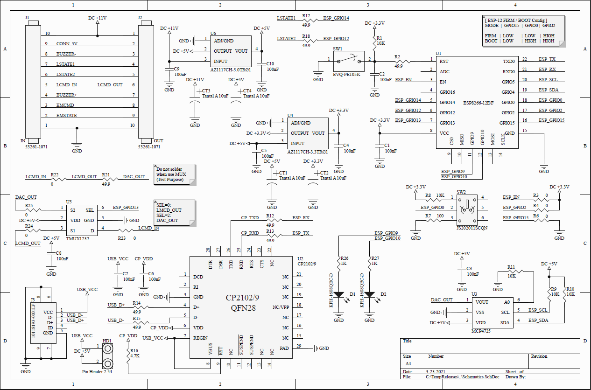
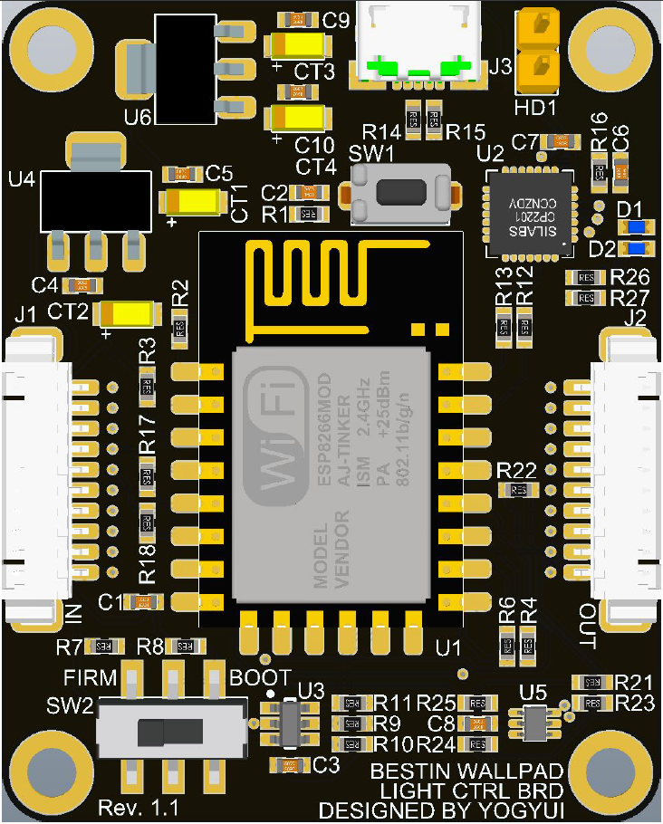

Summary
-------------
Wi-Fi + MQTT to control Bestin livingroom wallpad illuminations.  
PCB is designed using Altium PCB Designer.  
You can see details in 
[this article](https://yogyui.tistory.com/entry/%EA%B4%91%EA%B5%90%EC%95%84%EC%9D%B4%ED%8C%8C%ED%81%AC%EA%B1%B0%EC%8B%A4-%EC%A1%B0%EB%AA%85-Apple-%ED%99%88%ED%82%B7-%EC%97%B0%EB%8F%99-1).  

Firmware
-------------
You can download flash to ESP8266 using Arduino IDE.  
Source code is available in this repository ([link](https://github.com/YOGYUI/HomeNetwork/blob/main/IPark-Gwanggyo/Arduino/wallpad_livingroom_ctrl.ino)).  

Core IC
-------------
* ESP8266-12E/F: WiFi Module
* CP2102: USB-USART Convert (for flash download, debugging)
* MCP4725: DAC, voltage output to wallpad control signal
* TMUX1237: Multiplexer, switch output signal between wallpad touch signal and DAC output

You can see other ICs, passive elements in 
[BOM.xlsx](https://github.com/YOGYUI/HomeNetwork/blob/main/IPark-Gwanggyo/Arduino/BOM.xlsx).

Schematic Drawing
-------------

Assembly Drawing
-------------
