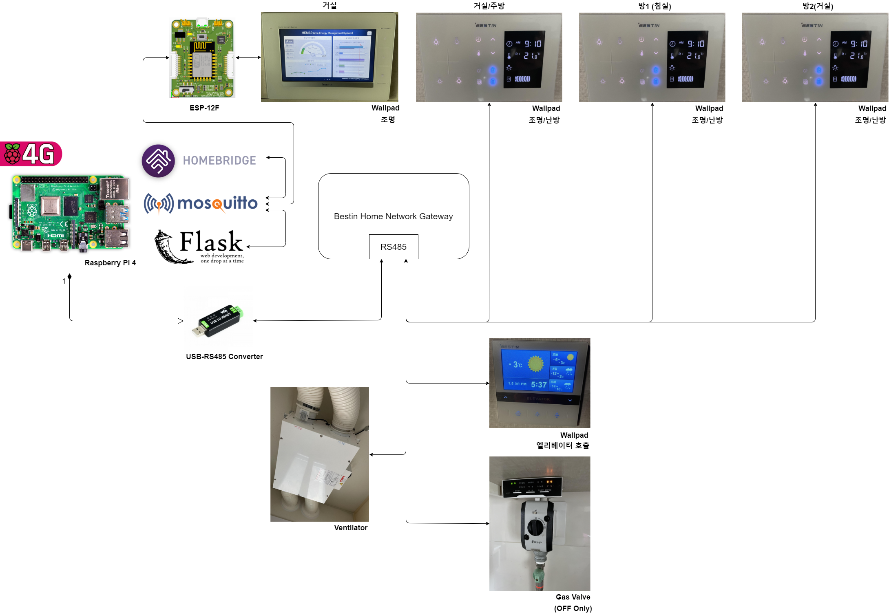

Summary
-------------
Integrate Gwanggyo I-Park Home Network (Bestin) to Apple HomeKit<br>
<br>


Install
-------------
```
git clone https://github.com/YOGYUI/HomeNetwork.git
```

Python Requirements
-------------
Python 3
```
flask
flask_wtf
flask_moment
flask_httpauth
flask_bootstrap
werkzeug
paho-mqtt
PyQt5
pyserial
requests
beautifulsoup4
```
Use pip to install packages
```
sudo pip3 install -r requirements.txt
```

How to run?
-------------
Bash example is written in [run.sh](https://github.com/YOGYUI/HomeNetwork/blob/main/IPark-Gwanggyo/run.sh) <br>
```
/bin/python3 /home/pi/Project/HomeNetwork/IPark-Gwanggyo/app.py
```

Notice
-------------
This project is designed to be run at Raspberry-Pi with Raspbian OS. <br>
However, I think any other platforms like Windows, Linux, Mac OS are also feasible to run because of cross-platform versatility of Python. <br>

At least three "RS485-to-USB" converters are needed to interact with all controllable devices. <br>
You can find the way to connect RS485 communication lines between converter and Bestin home network gateway in my blog (links are located at the bottom of this article). 
<br>
<br>
All accessories of [Homebridge](https://homebridge.io/) are implemented with
[Mqttthing](https://github.com/arachnetech/homebridge-mqttthing#readme) plugin.<br>
You should run [Mosquitto](https://mosquitto.org/), a.k.a. MQTT Broker, in somewhere. <br>
(In my case, homebridge and mosquitto are both run in "Raspberry-Pi 4 Model B" Device) <br>
You can see my Homebridge config file (json format) in
[homebridge_config.json](https://github.com/YOGYUI/HomeNetwork/blob/main/IPark-Gwanggyo/homebridge_config.json). <br><br> 
You should modify 'mqtt' tag in 
[config.xml](https://github.com/YOGYUI/HomeNetwork/blob/main/IPark-Gwanggyo/config.xml). <br>
```
<config>
    <mqtt>
        <host>...</host>
        <port>...</port>
        <username>...</username>
        <password>...</password>
    </mqtt>
```
* host: Mosquitto Ip Address 
* port: Mosquitto Port
* username: Mosquitto Authentication ID 
* password: Mosquitto Authentication Password

Reference URLs
-------------
I recommend you to read developer's notes in my blog.<br><br>
Illumination: [광교아이파크::조명 Apple 홈킷 연동](https://yogyui.tistory.com/entry/%EA%B4%91%EA%B5%90%EC%95%84%EC%9D%B4%ED%8C%8C%ED%81%AC-%EC%A1%B0%EB%AA%85-%ED%99%88%ED%82%B7-%EC%97%B0%EB%8F%99-1?category=937615) <br>
Thermostat: [광교아이파크::난방 Apple 홈킷 연동](https://yogyui.tistory.com/entry/%EA%B4%91%EA%B5%90%EC%95%84%EC%9D%B4%ED%8C%8C%ED%81%AC-%EB%82%9C%EB%B0%A9-%ED%99%88%ED%82%B7-%EC%97%B0%EB%8F%99-1?category=937615) <br>
Ventilator: [광교아이파크::환기(전열교환기) Apple 홈킷 연동](https://yogyui.tistory.com/entry/%EA%B4%91%EA%B5%90%EC%95%84%EC%9D%B4%ED%8C%8C%ED%81%AC-%ED%99%98%EA%B8%B0-%ED%99%88%ED%82%B7-%EC%97%B0%EB%8F%99-1?category=937615) <br>
Gas: [광교아이파크::가스 Apple 홈킷 연동](https://yogyui.tistory.com/entry/%EA%B4%91%EA%B5%90%EC%95%84%EC%9D%B4%ED%8C%8C%ED%81%AC-%EA%B0%80%EC%8A%A4-%ED%99%88%ED%82%B7-%EC%97%B0%EB%8F%99-2?category=937615) <br>
Elevator: [광교아이파크::엘리베이터 Apple 홈킷 연동](https://yogyui.tistory.com/entry/%EA%B4%91%EA%B5%90%EC%95%84%EC%9D%B4%ED%8C%8C%ED%81%AC-%EC%97%98%EB%A6%AC%EB%B2%A0%EC%9D%B4%ED%84%B0-%ED%99%88%ED%82%B7-%EC%97%B0%EB%8F%99-1-2?category=937615) <br>
Livingroom Illumination: [광교아이파크::거실 조명 Apple 홈킷 연동](https://yogyui.tistory.com/entry/%EA%B4%91%EA%B5%90%EC%95%84%EC%9D%B4%ED%8C%8C%ED%81%AC%EA%B1%B0%EC%8B%A4-%EC%A1%B0%EB%AA%85-Apple-%ED%99%88%ED%82%B7-%EC%97%B0%EB%8F%99-1?category=937615) <br>
Outlet: [광교아이파크::전원콘센트 Apple 홈킷 연동](https://yogyui.tistory.com/entry/%EA%B4%91%EA%B5%90%EC%95%84%EC%9D%B4%ED%8C%8C%ED%81%AC%EC%A0%84%EC%9B%90%EC%BD%98%EC%84%BC%ED%8A%B8-Apple-%ED%99%88%ED%82%B7-%EC%97%B0%EB%8F%99-1?category=937615) <br>
Airquality: [Apple 홈킷 - 외부 대기오염(Air-quality) 센서 추가하기](https://yogyui.tistory.com/entry/Apple-%ED%99%88%ED%82%B7-%EC%99%B8%EB%B6%80-%EB%8C%80%EA%B8%B0%EC%98%A4%EC%97%BC-%EC%84%BC%EC%84%9C-%EC%B6%94%EA%B0%80%ED%95%98%EA%B8%B0?category=937615) <br>
Doorlock: [광교아이파크::Bestin 현관문 도어락 연동](https://yogyui.tistory.com/entry/%EA%B4%91%EA%B5%90%EC%95%84%EC%9D%B4%ED%8C%8C%ED%81%ACBestin-%ED%98%84%EA%B4%80%EB%AC%B8-%EC%97%B0%EB%8F%99) <br>

Elfin-EW11 Compatible
--
```xml
<config>
    <rs485>
        <energy>
            <enable>1</enable>
            <type>1</type>  <!-- 0 = usb2serial, 1 = ew11 -->
            <usb2serial>
                <port>/dev/rs485_energy</port>
                <baud>9600</baud>
            </usb2serial>
            <ew11>
                <ipaddr>192.168.0.1</ipaddr>
                <port>8899</port>
            </ew11>
        </energy>
    </rs485>
</config>
```
RS485-to-WiFi Converter, like EW11, can be utilized in this project.<br>
Modify "type" tag value to 1 and IP Address and Port configurations in "ew11" tag. <br>
Module can be disabled by modifying "enable' tag value as 0.<br>
❗Caution❗ EW11-"TCP Server" is only available mode!

Use Multiple RS485 Converter in Same Port
--
⚠️It is not recommend to use multiple RS485 converter in same port.⚠️<br>
You can use different RS485 converters in same functional port by modifying Home.py code like below. <br>
('control' rs485 module should be disabled by change config.xml file.)
```python
class Home:
    def __init__(self, name: str = 'Home', init_service: bool = True):
        # ...
        self.rs485_energy_config = RS485Config()
        self.rs485_energy = RS485Comm('Energy')
        self.rs485_list.append(self.rs485_energy)
        self.parser_energy = EnergyParser(self.rs485_energy)
        self.parser_energy.sig_parse_result.connect(self.handlePacketParseResult)
        self.parser_energy.sig_raw_packet.connect(self.onParserEnergyRawPacket)
        self.parser_list.append(self.parser_energy)

        self.rs485_control_config = RS485Config()
        # self.rs485_control = RS485Comm('Control')
        # self.rs485_list.append(self.rs485_control)
        # self.parser_control = ControlParser(self.rs485_control)
        self.parser_control = ControlParser(self.rs485_energy)  # multi-converter, same port
        self.parser_control.sig_parse_result.connect(self.handlePacketParseResult)
        self.parser_control.sig_raw_packet.connect(self.onParserControlRawPacket)
        self.parser_list.append(self.parser_control)
```
